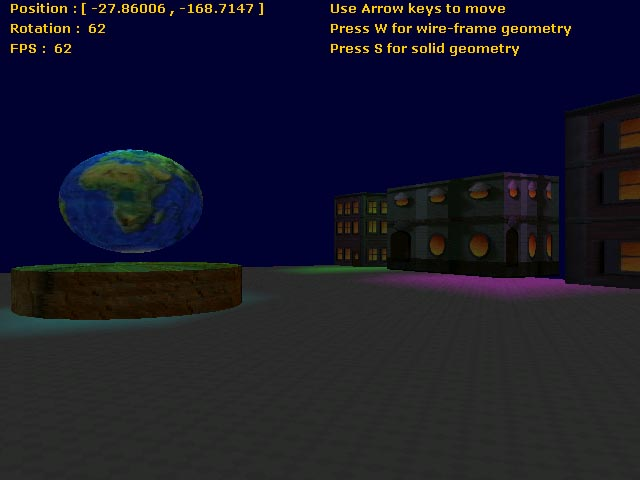



## a 3d street with lighting effects \- corrected

### Description

this prog uses DX-8. there was a minor problem which has now been fixed... it is a night scene of a street with lighting effects.... u can walk abount in the scene.... basically meant 4 beginners... however u should have a look at it. i sinscerely believe u will like it.... PLZ VOTE 4 IT.....
 
### More Info
 

             |
---                |---
**Submitted On**   |2005-07-05 18:47:40
**By**             |[aayush kaistha](https://github.com/Planet-Source-Code/PSCIndex/blob/master/ByAuthor/aayush-kaistha.md)
**Level**          |Beginner
**User Rating**    |5.0 (70 globes from 14 users)
**Compatibility**  |VB 6\.0
**Category**       |[DirectX](https://github.com/Planet-Source-Code/PSCIndex/blob/master/ByCategory/directx__1-44.md)
**World**          |[Visual Basic](https://github.com/Planet-Source-Code/PSCIndex/blob/master/ByWorld/visual-basic.md)
**Archive File**   |[a00\_3d\_str190930752005\.zip](https://github.com/Planet-Source-Code/aayush-kaistha-a-3d-street-with-lighting-effects-corrected__1-61480/archive/master.zip)

